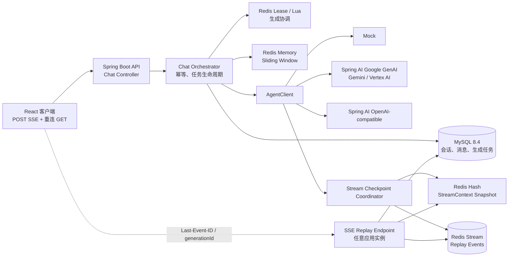
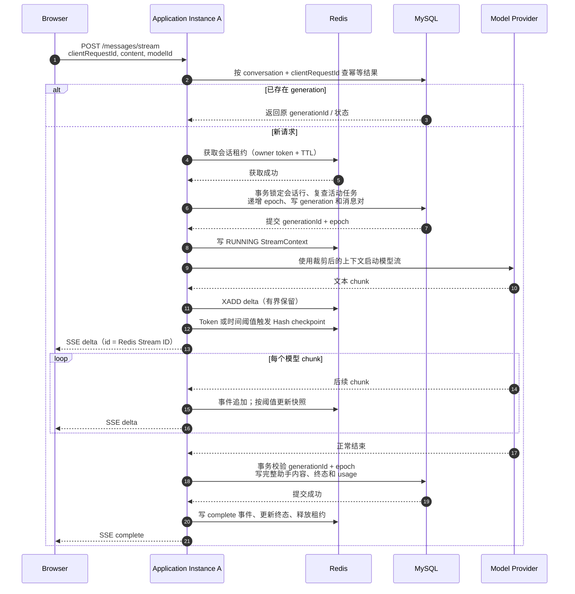
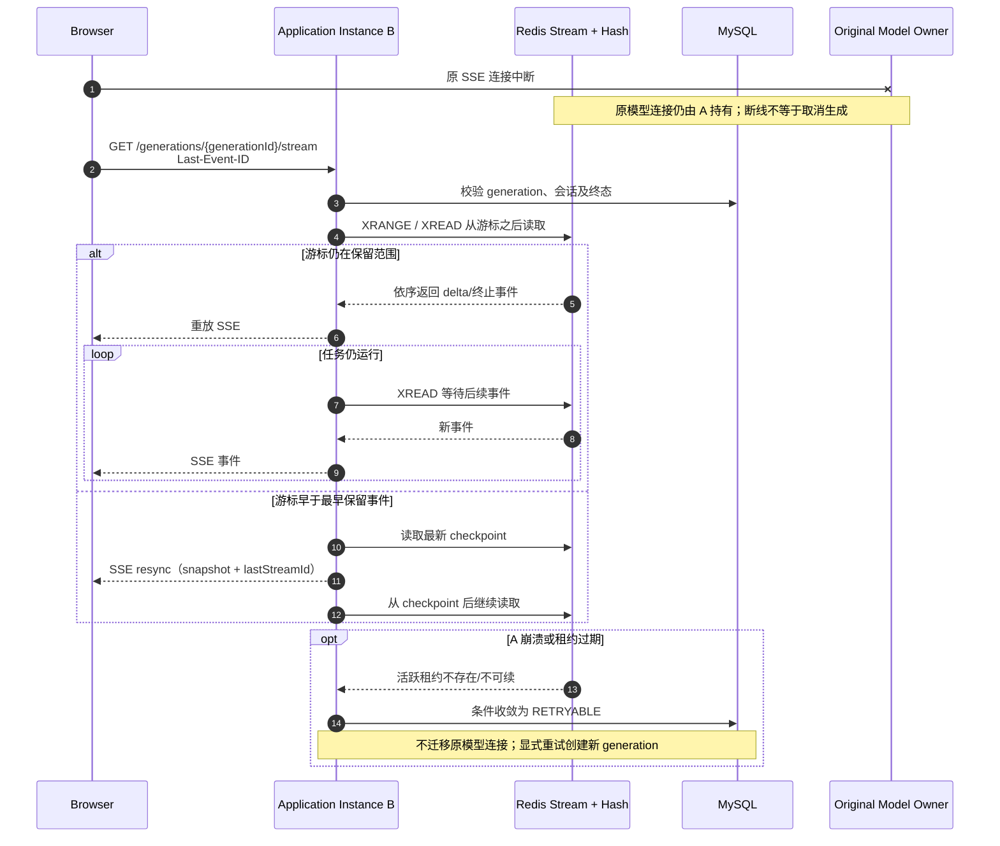
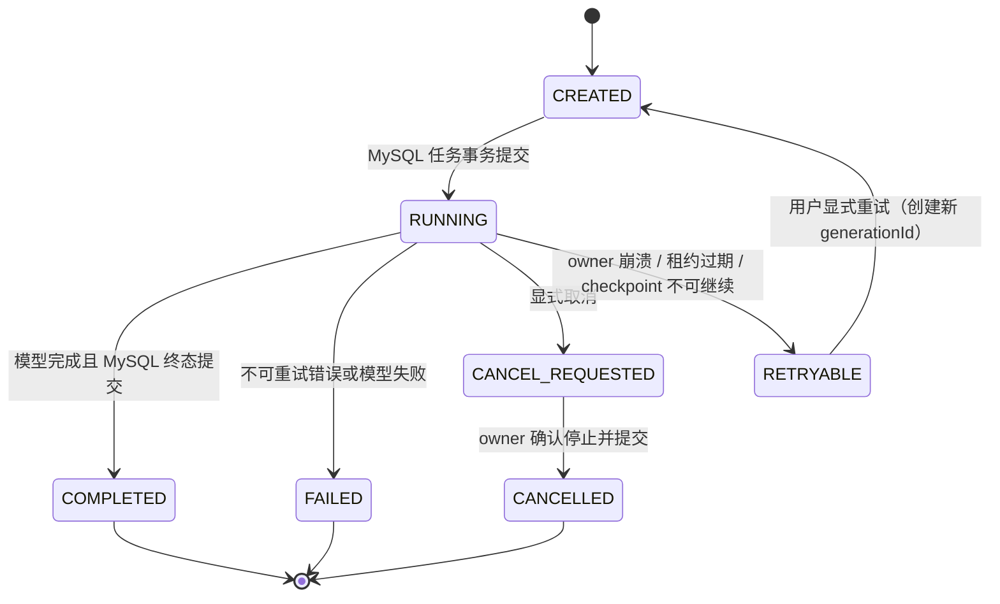
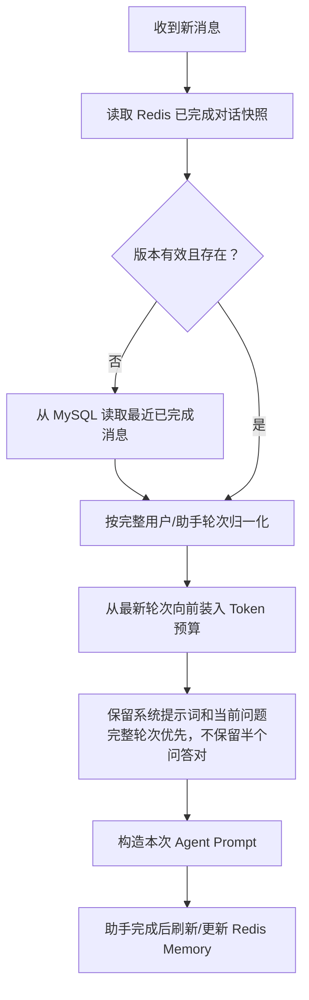

# tik-agent 二期技术方案说明

## 1. 文档信息

| 项目 | 内容 |
| --- | --- |
| 状态 | 方案已确认，尚未进入代码实现 |
| 适用项目 | `tik-agent` |
| 系统形态 | 单用户、无登录；本地 Docker Compose 可运行；核心服务按多实例部署设计 |
| 当前日期 | 2026-10-07 |
| 一期基线 | Spring Boot 4.1.1、Java 17、Spring AI 2.0.1、MySQL 8.4、MyBatis、POST SSE |

本文用于指导二期设计和后续实现。它不是实现清单，也不表示文中功能已经交付。

## 2. 背景与目标

一期已经实现会话和消息的 MySQL 持久化、Caffeine 短期上下文、Mock 与 OpenAI-compatible 模型、SSE 流式回答和服务启动时的中断消息修复。当前服务以单实例为运行边界，生成任务注册和缓存均在 JVM 内存中。

二期目标：

1. 接入可配置的真实 Gemini 模型，同时保留 Mock 与 OpenAI-compatible 模型。
2. 以 Redis 为活跃短期记忆和流式工作状态的数据源，以 MySQL 保存完整会话历史。
3. 使用 Token 预算与时间双阈值更新流式上下文 checkpoint，并支持客户端断线后重放 Redis 保留的 SSE 事件。
4. 通过 Redis 租约协调多实例任务，通过数据库事务和 fencing 校验保护消息及任务状态。
5. 用动态 Sliding Window 控制模型上下文大小；长期记忆、摘要提炼与 RAG 不在二期范围内。
6. 保持本地 Compose 启动简便，同时不把多实例部署能力绑定到 JVM 本地状态。

## 3. 设计原则与明确语义

### 3.1 数据所有权

| 数据 | 权威数据源 | Redis 的作用 |
| --- | --- | --- |
| 已完成会话和消息 | MySQL | 可缓存短期上下文 |
| 当前生成任务状态与 checkpoint | `chat_generations`（任务状态）和 Redis `StreamContext`（活跃工作快照） | 活跃任务协调、短期恢复与跨实例读取 |
| 流式增量事件 | Redis Stream，且有保留期限 | 按事件 ID 重放；过期或丢失后不可视为永久日志 |
| 模型凭证 | 环境注入的 Secret/凭证提供方 | 不写入 Redis、MySQL、日志或模型目录响应 |

MySQL 是会话历史的长期事实源。Redis 是活跃状态和短期恢复层，不替代 MySQL，也不承诺 Redis 故障或数据淘汰后仍能恢复每一段未完成增量。

### 3.2 恢复承诺

- **浏览器断线**：客户端可用 generation ID 和最后收到的 Redis Stream ID 连接任一应用实例，补发 Redis 尚保留的后续事件，并继续读取新事件。
- **连接切换实例**：新实例只负责从 Redis 读取和转发事件；原模型连接仍由最初发起请求的实例持有。
- **原应用实例或模型连接中断**：模型 HTTP 流不能跨进程迁移。租约过期后任务收敛为 `RETRYABLE`，用户显式重试时创建新的 generation ID。二期不自动从部分答案后重新调用模型。
- **Redis 事件已淘汰或不可用**：发送 `resync`，使用 Redis 最近 checkpoint 对齐客户端；若 checkpoint 也不可用，则以 MySQL 任务/消息状态为准，要求重新加载历史或显式重试。不会声称可恢复已丢失的流式字节。
- **MySQL 最终状态写入**：只允许通过当前任务 ID 和数据库 fencing epoch 条件更新；旧 owner 的过期写入必须被拒绝。

因此，“无缝恢复”在本方案中明确指：Redis 保留窗口内的事件补发与跨实例 SSE 接入，不指模型供应商连接的跨进程续传。

### 3.3 多实例一致性边界

Redis 租约是协调与快速互斥机制，不单独承担数据库一致性的最终证明。MySQL 会话行锁、活动任务约束、单调递增的数据库 generation epoch 和条件更新共同构成最终写保护。Redis 的异步复制/故障切换可能影响活跃状态的可用性；系统对此采取 fail-closed（停止生成或重试）的策略，不允许在协调状态不确定时继续写最终结果。

## 4. 方案选型

### 4.1 大模型适配

采用 Spring AI 的模型抽象和项目现有 `AgentClient` 边界：

- 增加 Spring AI Google GenAI 适配器，开发/本地环境通过环境变量提供 Gemini Developer API Key。
- 保留 OpenAI-compatible 适配器，继续支持兼容端点。
- 保留 Mock 适配器，作为无密钥开发、测试和 Compose 默认模型。
- 生产环境预留 Vertex AI 项目/区域/Google Cloud 凭证模式；不把 Vertex AI 作为本地开发的前置条件。
- 模型 ID、供应商、模型名、超时、温度、启用状态由配置定义；密钥只经 Secret/环境注入。
- Agent 输出从仅有文本的 `Flux<String>` 演进为带文本增量和可选终止元数据的领域事件流，例如 `AgentStreamChunk`。供应商元数据不得泄漏进 HTTP DTO，除非经过明确白名单转换。

Spring AI Google GenAI 适配同时覆盖 Gemini Developer API 与 Vertex AI，并提供流式模型接口。项目当前 Spring AI BOM 为 2.0.1，实施时应锁定该 BOM 管理的兼容 Starter 版本，不单独覆盖依赖版本。模型具体名称配置化，不硬编码到业务逻辑中。

### 4.2 活跃记忆与流事件

采用 **Redis Hash 快照 + Redis Stream 事件日志**：

- Hash 保存活跃生成任务的最新快照和 checkpoint 元数据。
- Stream 保存已对外发送的有序 delta 与终止事件，可由多个独立连接分别读取。
- 不使用 Consumer Group 传递浏览器事件：消费者组会在消费者间分摊工作，不符合多个重连客户端各自重放同一会话事件的语义。连接读取使用 `XREAD` / `XRANGE` 一类非破坏性读取。
- Stream 按最大长度和 TTL 限制内存；Redis 持久化和高可用按部署环境配置，但恢复保证仍受数据保留与故障切换边界约束。

Redis Streams 提供有序 ID、范围查询、阻塞读取和显式裁剪能力，适合作为有限保留期的重放日志。它并不自动提供永久存储或跨故障的强一致性。

### 4.3 分布式协调

- Redis 租约使用带 TTL 的 owner token，续期/释放通过 Lua 原子校验 owner token。
- 同一会话的“是否已有活动任务”由 MySQL 事务在会话行锁下再次检查，避免 Redis 与数据库非原子双写导致重复任务。
- 数据库生成 epoch 单调递增，写入 generation 和助手消息时校验 generation ID、epoch 与可更新状态。
- 所有 Redis Lua 操作相关 Key 使用相同 Cluster hash tag，保证 Redis Cluster 中脚本所需 Key 同槽。
- 租约丢失、续期失败或 Redis 状态不可验证时，当前生成必须停止或进入可恢复错误，不允许降级成仅靠进程内锁继续运行。

Redis 官方锁文档也明确提示需要考虑 fencing token 和故障切换期间的时钟/复制边界。本方案通过数据库 epoch 保护最终持久化，不将 Redis TTL 本身视作绝对安全保证。

## 5. 逻辑架构



### 5.1 模块职责

| 模块 | 职责 |
| --- | --- |
| `conversation` | MySQL 会话、消息与 generation 持久化，事务和状态条件更新 |
| `chat` | 请求幂等、生成生命周期、租约、取消、恢复和 SSE 编排 |
| `memory` | Redis 短期上下文读取、回源、窗口裁剪、版本与失效 |
| `agent` | Mock、Gemini、OpenAI-compatible 供应商适配与模型目录 |
| `stream` | 增量规范化、事件序号、Redis Stream 写入、checkpoint 和 SSE 重放 |
| `common` | 错误码、请求 ID、基础设施错误映射与可观测性标签 |
| `ui/api` | 生成 ID 管理、SSE 帧解析、最后事件 ID 持久于当前页面状态、断线重连 |

Controller 不直接操作 Redis/MySQL Mapper；Agent 适配器不写会话数据；Redis Key 和供应商原始对象不暴露给前端。

## 6. 核心业务流程

### 6.1 创建生成任务与流式输出



### 6.2 客户端断线重连与事件补发



实现时要避免竞态：先读取/校验当前 Stream 边界，再以最后读取到的 ID 开始 `XREAD`；不能用 `$` 在已经发生并发写入后初始化监听游标，否则可能漏掉边界期间新增事件。

### 6.3 服务实例故障和显式重试



`RETRYABLE` 不是正在运行的任务，也不允许新实例假装接管原供应商连接。图中的重试边表示创建一条新的 generation 记录，不是把原记录的状态回退到 `CREATED`。任务可保留部分答案供 UI 展示，并由用户明确发起新 generation。

### 6.4 Sliding Window 上下文构造



## 7. 数据设计

### 7.1 MySQL

新增 Flyway 迁移（建议 `V2__create_generation_schema.sql`），不修改已发布的 V1 迁移。

新增 `chat_generations`，至少包含：

| 字段 | 含义 |
| --- | --- |
| `id` | generation 主键 |
| `conversation_id` | 所属会话 |
| `client_request_id` | 客户端一次发送操作的幂等键 |
| `user_message_id` / `assistant_message_id` | 对应消息 |
| `model_id` | 本次模型 ID |
| `status` | `CREATED/RUNNING/CANCEL_REQUESTED/COMPLETED/FAILED/CANCELLED/RETRYABLE` |
| `fence_epoch` | 在会话行锁事务中分配的单调 epoch |
| `retry_of_generation_id` | 可空，显式重试的来源任务 |
| `error_code` | 稳定错误码，不存储密钥或完整供应商异常 |
| `input_token_count` / `output_token_count` | 可空的模型 usage |
| `created_at` / `updated_at` / `completed_at` | 生命周期时间 |

约束与索引：

- `UNIQUE(conversation_id, client_request_id)`：同一会话中 POST 重试返回同一任务。
- `UNIQUE(assistant_message_id)`：一个 generation 绑定一个助手占位消息。
- `INDEX(conversation_id, status, updated_at)`：恢复扫描和会话状态查询。
- 需要保证一个会话同一时刻最多有一个活动 generation。MySQL 通过会话行 `SELECT ... FOR UPDATE` 串行化创建；在同一事务内检查活动状态并写入 generation。不能单靠可空列的唯一索引表达活动状态。
- 在 `conversations` 增加 `generation_epoch`（或等价单调计数器）；在锁定会话行的事务中递增并写入 generation。

消息仍以 `messages` 为历史载体；可增加可空 `generation_id` 关联任务。既有记录保持 `NULL`，历史兼容。助手的 `STREAMING` 占位记录在终态事务中以条件更新完成。

### 7.2 Redis Key 命名

建议使用统一前缀 `tik:v2`。所有同一会话需要在 Lua 中共同校验的 Key 使用相同 hash tag：

```text
tik:v2:conv:{conversationId}:active
tik:v2:conv:{conversationId}:lease
tik:v2:conv:{conversationId}:memory
tik:v2:gen:{conversationId}:{generationId}:context
tik:v2:gen:{conversationId}:{generationId}:events
```

`{conversationId}` 是 Redis Cluster hash tag。若实际 Lua 脚本要跨会话访问 Key，须重新评估同槽约束；本设计禁止在单次脚本中跨会话更新。

### 7.3 短期记忆 Hash

`tik:v2:conv:{conversationId}:memory` 保存已完成消息窗口：

```text
schemaVersion
mysqlConversationUpdatedAt
messageSequence
messages（序列化领域消息）
estimatedTokens
messageCount
updatedAt
```

版本/更新时间用于判断缓存是否落后。Redis miss、版本不匹配或解码失败时，从 MySQL 回源并重建；Redis 错误不得导致历史消息丢失。删除会话时，在 MySQL 删除成功后清理关联 Redis Key。

### 7.4 StreamContext Hash

每个 generation 的 `context` Hash 保存：

```text
schemaVersion
generationId
conversationId
assistantMessageId
modelId
status
fenceEpoch
ownerInstanceId
lastStreamId
lastCheckpointStreamId
checkpointSequence
contentSnapshot
contentLength
estimatedOutputTokens
lastCheckpointAt
leaseExpiresAt
errorCode
updatedAt
```

字段作用域只限一个 generation；新一代重试使用全新 Hash 和 Stream，不覆盖旧任务数据。

### 7.5 Redis Stream 事件结构

Stream 中的每条记录至少包括：

```text
type = delta | complete | error | cancelled | resync
generationId
fenceEpoch
delta（仅 delta）
sequence
createdAt
```

Redis Stream ID 作为 SSE `id`，在前端按不透明字符串保存和回传。不要将 Stream ID 转成 JavaScript Number 或自建毫秒时间 ID。事件日志设置明确的最大长度、最大单任务输出、过期时间和容量告警阈值；具体数值经压测确定。

## 8. Checkpoint 与流式处理

### 8.1 事件与快照采用不同写入频率

每个将要对外发送的 delta 先追加到 Redis Stream，再发送 SSE，确保已发事件可被重放。Hash 快照不必每个 delta 都重写；在 Token 或时间阈值触发时更新：

```text
累计估算输出 Token >= T_token
或距离上次成功快照 >= T_time
```

初始建议 `T_token = 32`、`T_time = 1s`，均为可配置起点，需以延迟、Redis 写入量和断线恢复目标压测调整，不是固定的 SLA。流结束时无条件写最后一次 checkpoint。

Stream append 与阈值快照更新应通过同槽 Lua 脚本校验 owner token、generation ID、epoch 和任务状态；脚本执行顺序为：

1. 校验当前 Redis 活动 generation、租约 owner 和 epoch。
2. 追加 delta event，获得 Redis Stream ID。
3. 更新 `lastStreamId` 和本地序号。
4. 达到 checkpoint 阈值时，以完整内容快照更新 Hash，并写入 checkpoint 游标/时间。
5. 返回 Stream ID 与是否已 checkpoint。

只有该增量成功入 Stream 后才允许向客户端发送对应 delta。若 Redis 写入失败，暂停或停止向客户端发送新增量，避免客户端收到无法重放的内容；重试次数耗尽后终止当前 generation 并保存可得部分内容。

**裁剪与 resync 必须保持游标连续**：事件保留策略只能裁剪到已由 `contentSnapshot` 完整覆盖的 `lastCheckpointStreamId`，并保留其后的事件。若发现最早保留事件已经越过 checkpoint 游标，且快照无法覆盖被裁剪区间，则不能发送看似完整的 `resync`；应读取可验证的更新快照，否则将任务/连接标记为不可恢复并要求客户端重新加载历史或显式重试。最大长度的近似裁剪不能单独作为“无缺口恢复”的依据。

### 8.2 Token 估算和动态窗口

- Token 预算按所选模型的上下文窗口配置；系统提示词、历史和当前问题均计入。
- 优先使用与目标模型相符的 Tokenizer；若某模型没有可用 Tokenizer，采用保守估算器并预留安全余量。Token 估算明确标为近似值，不用来计费。
- 装载历史时从最近完整问答轮次向前回溯，超过预算即停止；始终保留系统提示词与当前用户输入。若当前问题本身超预算，返回明确的参数错误，不静默截断用户输入。
- Gemini/OpenAI-compatible 最终 usage（如果供应商返回）用于观测和校正，不回写篡改历史 prompt。
- 二期不生成摘要、不合并长期知识；被 Sliding Window 排除的消息仍留在 MySQL。

## 9. API 与 SSE 协议

现有历史 REST 和消息列表保持兼容。

### 9.1 创建或幂等获取生成

```http
POST /api/v1/conversations/{conversationId}/messages/stream
Accept: text/event-stream
Content-Type: application/json
```

请求增加必需的 `clientRequestId`（UUID），其他字段维持 `content`、`modelId`。服务端以 `(conversationId, clientRequestId)` 幂等。第一次成功接受后返回 `message` / `delta` 等 SSE 事件；如果网络重试命中已有任务，返回同一 generation 并进入其事件流，不创建第二次模型调用。

### 9.2 恢复读取

```http
GET /api/v1/conversations/{conversationId}/generations/{generationId}/stream
Accept: text/event-stream
Last-Event-ID: <opaque-redis-stream-id>
```

客户端使用 `fetch`，因为现有 POST SSE 已基于 Fetch，且便于设置 Header 和 AbortSignal。服务端校验 generation 与 conversation 归属。终态 generation 也可以读取保留期内的事件。

事件：

| 事件 | 行为 |
| --- | --- |
| `message` | 首次接受时返回用户消息、助手占位消息及 generation ID |
| `delta` | 带 Stream ID 的文本增量 |
| `resync` | 客户端事件游标过早/被裁剪时，返回 checkpoint 内容和新的游标 |
| `complete` | 助手消息及最终终态 |
| `error` | 稳定业务错误码和可安全显示的信息 |
| `cancelled` | 已确认取消的终态 |
| `heartbeat` | 注释帧或无业务数据心跳，不推进消息状态 |

已知 generation 但 Redis Stream 已不存在时，不能默认为空历史。查询 MySQL 任务状态：终态则返回最终消息；仍标记 RUNNING 但 Redis 状态丢失时，条件收敛为 `RETRYABLE`，告知客户端刷新/显式重试。

### 9.3 显式取消

```http
POST /api/v1/conversations/{conversationId}/generations/{generationId}/cancel
```

取消命令在 Redis/数据库校验当前 generation 和 epoch 后转为 `CANCEL_REQUESTED`。模型 owner 观察取消标记并 dispose 上游订阅，保存部分内容，写入 MySQL `CANCELLED` 终态和 Redis 终止事件。浏览器断开本身不等价于取消，以支持断线恢复；取消由明确 API 表达。

### 9.4 显式重试

对 `RETRYABLE`、可重试 `FAILED` 或 `CANCELLED` 的任务，用户通过原发送工作流创建新 `clientRequestId`。新任务使用新的 generation ID、新 epoch、新 Redis Stream，并在 MySQL 中记录 `retry_of_generation_id`。不会在原 Stream 中拼接两个模型回答。

## 10. 事务、幂等与故障处理

### 10.1 任务创建

Redis 与 MySQL 无跨系统分布式事务。采用“租约预占 + MySQL 权威创建 + Redis 初始化”的受控流程：

1. 校验输入、模型可用性和会话存在。
2. 查询幂等键；命中则返回既有任务。
3. 原子获取 Redis 会话租约；若租约冲突，按 `clientRequestId` 有界等待/查询 MySQL 的创建事务结果。若同一幂等请求已落库，返回原 generation；若是不同请求，则返回活动 generation 状态或 `GENERATION_IN_PROGRESS`。等待超时则返回可重试的冲突/基础设施错误，不能创建第二个任务。
4. MySQL 事务锁定会话行，再次检查活动 generation 和幂等键，递增 epoch，写入 generation、用户消息和助手占位消息。
5. 事务失败时按 owner token 释放 Redis 租约。
6. 事务成功后初始化 Redis 活跃状态，再启动 Agent。
7. Redis 初始化失败时，不启动模型；MySQL 任务条件转入 `RETRYABLE`，释放租约。

因应用在任一双写步骤崩溃，后台恢复扫描以 MySQL 状态为准，并清理过期 Redis Key。

### 10.2 正常完成

1. 停止接受新的模型增量。
2. 尝试写入最终 Redis checkpoint。checkpoint 失败时，如果 owner 仍在且内存中持有完整答案，仍继续写 MySQL；若 owner 在 MySQL 提交前崩溃，则按最近可验证 checkpoint 恢复为 `RETRYABLE`。
3. 在 MySQL 单一事务内，使用 `generationId + fenceEpoch + RUNNING` 条件将助手完整内容、消息状态、usage 和 generation 终态更新为 `COMPLETED`。
4. 仅在 MySQL 提交成功后写 Redis `complete` 事件、更新 Hash 终态并释放租约。
5. 若 MySQL 成功、Redis 终态写失败，读流端检查 MySQL；对终态任务合成 `complete` 响应，避免把已提交结果报告成失败。
6. 若 MySQL 条件更新影响行数为 0，说明 owner 已失效或任务状态已变化；不得覆盖数据库状态。

### 10.3 失败与重试

- 首个文本增量之前发生的可重试网络/限流错误，可按有限次数指数退避重试；每次必须确认仍持有租约。认证/参数错误不重试。
- 已产生任何对外 delta 后发生错误，不自动重放模型请求。保存可得部分内容，记录稳定错误码，按策略进入 `FAILED` 或 `RETRYABLE`。
- 模型调用超时、应用流超时、租约续期超时和客户端读取超时分开配置，防止一个 timeout 覆盖其他生命周期。
- 供应商异常不得直接返回用户，也不得记录包含 prompt、Authorization Header 或 API Key 的异常内容。

### 10.4 故障矩阵

| 故障 | 处理 |
| --- | --- |
| Redis 创建前不可用 | 返回基础设施错误，不启动模型，不伪造“已接受” |
| Redis 租约续期失败 | owner 停止消费模型流；MySQL 条件收敛为 `RETRYABLE` |
| Redis Stream 写入失败 | 不发送对应 delta；有限退避后终止，避免不可重放输出 |
| Redis checkpoint 失败但 Stream append 成功 | 暂停发送直至检查点/队列积压恢复；若无法恢复则进入 `RETRYABLE` |
| MySQL 终态事务失败 | 不发送 `complete`；保留 Redis 快照，重试数据库条件更新或进入恢复队列 |
| MySQL 已完成、Redis 终态写失败 | MySQL 终态为准，读端合成终止事件 |
| 应用实例崩溃 | 租约 TTL 后后台将任务收敛为 `RETRYABLE`，保留部分 checkpoint |
| Redis Stream 被裁剪 | 返回 `resync` 快照和新游标 |
| Redis 活跃数据整体丢失 | 查 MySQL；运行中任务转 `RETRYABLE`，已完成历史正常可读 |
| 删除会话时仍在生成 | 数据库事务删除会话级联消息并使 generation 失效；取消/清理 Redis 活跃任务；旧 owner 的 epoch 条件写被拒绝 |

## 11. 配置、安全与部署

### 11.1 本地 Compose

增加 Redis 服务及健康检查，server 等待 MySQL、Redis 可用。开发 Compose 可使用单节点 Redis；运行方式与目标生产部署采用同一 Redis API，但本地单节点不代表高可用演练通过。

配置项至少包括：

```text
TIK_AGENT_DEFAULT_MODEL
TIK_AGENT_GEMINI_ENABLED
TIK_AGENT_GEMINI_API_KEY
TIK_AGENT_GEMINI_MODEL_NAME
TIK_AGENT_OPENAI_*
REDIS_URL / Redis 用户与密码 / TLS
TIK_AGENT_MEMORY_TOKEN_BUDGET
TIK_AGENT_MEMORY_MAX_MESSAGES
TIK_AGENT_STREAM_CHECKPOINT_TOKEN_THRESHOLD
TIK_AGENT_STREAM_CHECKPOINT_INTERVAL
TIK_AGENT_STREAM_EVENT_MAX_LENGTH
TIK_AGENT_STREAM_EVENT_TTL
TIK_AGENT_GENERATION_LEASE_TTL
TIK_AGENT_GENERATION_LEASE_RENEW_INTERVAL
TIK_AGENT_GENERATION_TIMEOUT
```

生产环境使用托管 Redis 高可用、鉴权、TLS、备份/持久化和网络隔离；本地可通过环境变量注入。具体托管 Redis 产品和容量不在二期锁定。

### 11.2 凭证处理

- 进度文档中曾出现 Gemini API Key；该凭证应视为已泄露并立即在 Google AI Studio 撤销/轮换。
- 文档、Git、日志、数据库、Redis 和测试夹具均不得保存真实密钥。
- `.env` 保持 Git 忽略；`.env.example` 只提供空变量名和说明。
- 模型列表接口只返回 ID、展示名、供应商和默认标记，不返回 Key、Base URL 凭证部分或云身份信息。
- 日志只保留 request ID、generation ID、conversation ID、model ID、状态和耗时；内容日志默认关闭。
- 现系统仍是无登录单用户应用。部署在可信本机/受控网络边界内；若暴露公网，认证、CSRF/Origin 防护、速率限制和用户隔离必须先作为额外安全项目完成，二期方案不把“无登录”解释为适合公网。

## 12. 可观测性与容量保护

### 12.1 指标

- `generation_started/completed/failed/cancelled/retryable_total`
- generation 首字节延迟、总耗时、输出估算/实际 token 数
- Redis lease acquire conflict、renew failure、checkpoint latency/error
- Stream append 数、裁剪数、事件数量/字节数、重连次数、resync 次数
- Redis Memory miss、DB fallback、窗口裁剪消息数和估算 Token 数
- 活跃 generation 数、过期任务收敛数、MySQL 条件更新冲突数

指标标签禁止包含用户文本、API Key、完整 prompt 或高基数 generation ID。generation ID 可用于结构化日志关联，但不能作为指标标签。

### 12.2 背压与上限

- 对单任务设置最大生成时长、最大输出字节/Token 和最大重放事件数。
- SSE 客户端慢消费不应无限堆积 JVM 内存；限制待发送队列，超过上限时断开连接并由客户端重连回放。
- Redis 不可用时禁止无限本地缓冲，有限重试后 fail closed。
- 模型并发数、线程/连接池和全局限流配置化；单会话互斥之外也要有实例级并发上限。
- 对话记忆只传递完整问答轮次；窗口与事件日志设置容量上限。

## 13. 测试与验收标准

### 13.1 测试层次

1. **单元测试**：模型供应商配置路由、消息角色转换、滑动窗口与 Token 预算、状态转移、错误码映射。
2. **Redis 集成测试**：使用 Testcontainers Redis 验证 Lua 租约、owner 校验、epoch 校验、Stream ID、事件回放、裁剪和过期。
3. **MySQL 集成测试**：使用现有 Testcontainers MySQL 验证 V2 迁移、事务回滚、会话行锁、幂等唯一约束、终态条件更新和旧 epoch 拒绝。
4. **端到端测试**：Compose + Mock 验证创建、增量、断线重连、完成、取消、显式重试及页面恢复。
5. **真实供应商冒烟测试**：仅在凭证通过本机 Secret 注入时手动执行；默认 CI 不依赖 Gemini 网络或密钥。
6. **并发/故障注入**：两个应用实例竞争同一会话；在模型生成中终止 owner；模拟 Redis/DB 不可用、租约过期和终态双写窗口。

### 13.2 必须通过的验收

- 相同 `(conversationId, clientRequestId)` 的并发 POST 只能创建一个 generation、一个用户/助手消息对和一次模型调用。
- 不同请求对同一会话并发创建时最多一个活动任务成功。
- 旧 `fenceEpoch` 不能改写 generation、助手消息和 Redis 活跃快照。
- Redis Stream 中已发给客户端的 delta 可以通过 `Last-Event-ID` 在另一实例重放，顺序和内容不变。
- Stream 游标被裁剪时前端通过 `resync` 正确替换本地部分回答，再继续接收增量。
- Checkpoint 在 Token 阈值、时间阈值、流结束三种路径都会更新；普通流中仍能保持即时 SSE，不等待 checkpoint 才输出。
- Redis 中断不会破坏已完成 MySQL 会话；未完成任务会明确失败/可重试，不静默消失或伪装完成。
- 模型首 Token 前有限重试生效；首 Token 后不自动重复调用模型。
- Sliding Window 不超过配置的消息数和 Token 预算，当前问题和系统提示词保留，MySQL 历史完整。
- 默认 Mock Compose 全链路无需密钥；Gemini 凭证只通过环境/Secret 提供。
- 前端、后端、迁移、单元/集成测试和部署文档均更新；SSE 反向代理不缓冲响应。

## 14. 实施分阶段建议

技术方案确认后，建议按以下依赖顺序分阶段编写实现计划和验收：

1. **基础设施与配置**：Redis Compose、连接池、健康检查、密钥模板、Gemini 模型目录。
2. **MySQL 任务模型**：V2 迁移、事务任务创建、幂等键、会话锁和数据库 epoch。
3. **Redis 记忆与租约**：滑动窗口、回源缓存、会话租约、Lua owner/epoch 校验。
4. **流事件与 checkpoint**：Agent chunk、Redis Stream、Hash 快照、阈值调度、终态写入。
5. **SSE 恢复与取消**：generation ID、Last-Event-ID、resync、跨实例读取、显式取消和重试。
6. **故障恢复、可观测性与验收**：恢复扫描、指标、故障注入、Compose E2E 和部署文档。

每阶段均维持 Mock 可运行，避免真实供应商依赖阻塞基础设施和协议测试。

## 15. 不在二期范围内

- 长期记忆提炼、摘要、向量数据库和 RAG。
- 模型连接跨进程迁移或供应商流请求断点续传。
- 自动在部分回答后重新生成并去重语义内容。
- 登录、用户/组织/租户、权限、配额和公网身份认证。
- Kafka、独立任务编排平台或微服务拆分。
- Redis Streams 永久事件审计；它只作为有界的短期恢复日志。
- 动态在线修改模型密钥或在 UI 中管理供应商凭证。

## 16. 参考资料

- [Spring AI Google GenAI Chat](https://docs.spring.io/spring-ai/reference/api/chat/google-genai-chat.html)：Google GenAI Starter、Developer API/Vertex AI 凭证模式与流式调用。
- [Spring AI Chat Model API](https://docs.spring.io/spring-ai/reference/api/chatmodel.html)：跨供应商 `ChatModel` / 流式模型抽象。
- [Redis Streams](https://redis.io/docs/latest/develop/data-types/streams/)：Stream ID、`XRANGE`、`XREAD`、保留与消费语义。
- [Redis Distributed Locks](https://redis.io/docs/latest/develop/clients/patterns/distributed-locks/)：租约、互斥/活性边界、fencing token 与故障切换注意事项。
- 项目一期基线：[一期技术方案说明](一期技术方案说明.md)、[接口说明](../接口说明.md)、[部署说明](../部署说明.md)。
